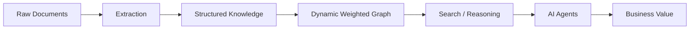
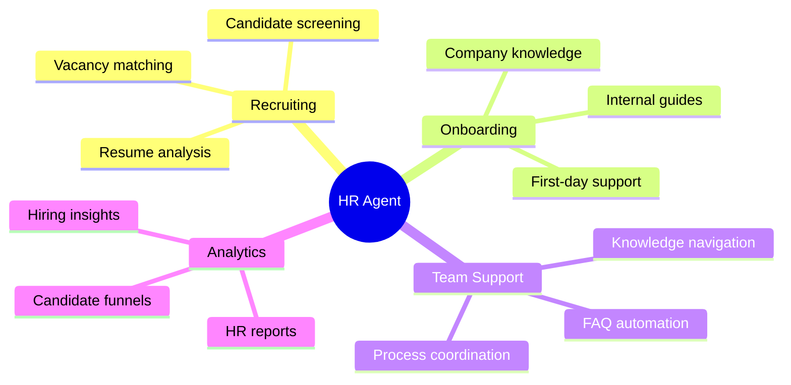
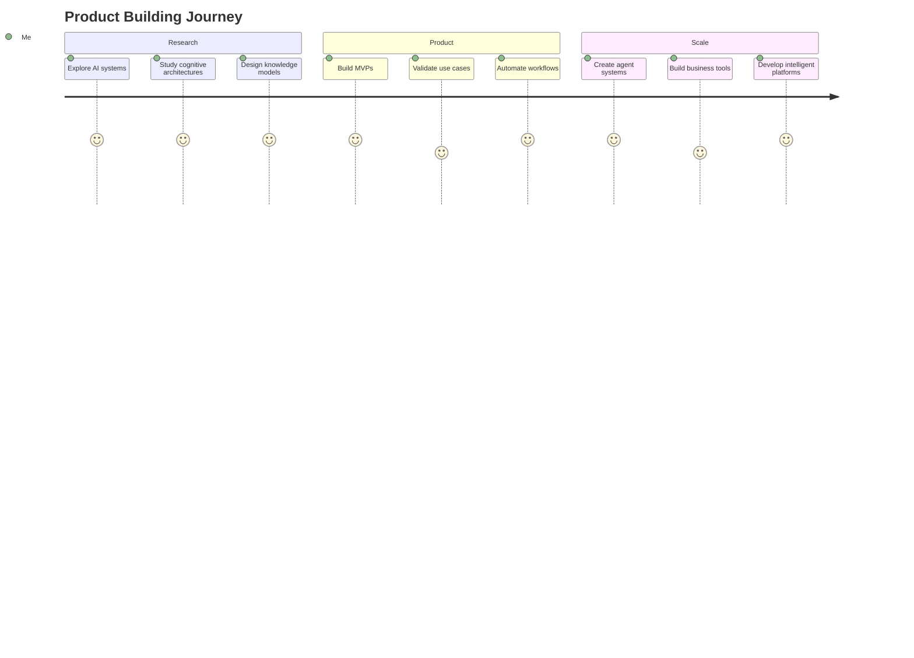

<!-- HERO SECTION -->

# 👋 Hi there, I'm Beefboy35

### 🧠 R&D · Senior Developer · Product/Project Manager · AI Systems Architect

Building intelligent systems at the intersection of  
**AI Agents · Knowledge Graphs · EdTech · Automation · HR Tech · Human-Machine Intelligence**

 

 

> 🧩 “To master a system, you must first learn to think like it — and then teach it to think with you.”

---

## 🚀 About Me

I’m an **R&D Chief, Senior Developer, Product/Project Manager and CTO of StudyNinja**.

I build products that combine:

<table>
<tr>
<td width="50%">

### 🧠 Intelligence Layer

- AI agents
- LLM systems
- memory architectures
- reasoning workflows
- knowledge graphs
- distributed systems and P2P networks  
- blockchain and token economies  
- adaptive learning systems

</td>
<td width="50%">

### ⚙️ Execution Layer

- fullstack products
- backend architecture
- business automation
- HR process automation
- project delivery
- startup development

</td>
</tr>
</table>

My main focus is not just writing code, but designing systems that can:

- understand processes;
- structure knowledge;
- automate routine work;
- support decision-making;
- help people, teams and businesses become more effective.

I have hands-on experience as a **Project Manager**, working with:

`Product Planning` · `Roadmaps` · `Task Decomposition` · `Technical Specifications` · `Client Communication` · `Team Coordination` · `Delivery Management`

I also explore and build **HR-oriented AI agents** that can support:

`Recruiting` · `Candidate Screening` · `Onboarding` · `Internal Support` · `Knowledge Navigation` · `Team Coordination`

---

# 🧠 Core Product Ecosystem

```mermaid
graph TD
    A[Beefboy35 / R&D Core] --> B[StudyNinja]
    A --> C[KnowledgeBaseAI]
    A --> D[XTeam AVA]
    A --> E[HR Agent]
    A --> F[MAGIC / MagicWorld]
    A --> G[Balansis]
    A --> H[VilaviAI]
    A --> I[Fullstack Products]
    A --> J[Database Systems]

    B --> B1[Adaptive Learning]
    B --> B2[AI Tutor]
    B --> B3[Knowledge Graph Curriculum]

    C --> C1[Corporate Knowledge]
    C --> C2[Agent Memory]
    C --> C3[Dynamic Weighted Graphs]

    D --> D1[Business Process Analysis]
    D --> D2[ROI Estimation]
    D --> D3[AI Automation Roadmaps]

    E --> E1[Recruiting Automation]
    E --> E2[Onboarding]
    E --> E3[HR Support]

    F --> F1[Human-AI Symbiosis]
    F --> F2[AGI Architecture]
    F --> F3[Cognitive Systems]

    G --> G1[Absolute Compensation Theory]
    G --> G2[Zero-Sum Theory of Infinities]
    G --> G3[Computational Experiments]

    H --> H1[AI Product Direction]
    H --> H2[Automation Scenarios]

    I --> I1[Web Apps]
    I --> I2[Dashboards]
    I --> I3[Admin Systems]

    J --> J1[Data Models]
    J --> J2[ETL / Pipelines]
    J --> J3[Search / Storage]
```

---

# 🚀 Latest Core Projects

## 🥷 StudyNinja

> **AI-powered educational platform for adaptive learning.**

StudyNinja helps students learn through personalized learning paths, AI tutor interactions and knowledge graph-based curriculum structure.

### Product Focus

| Area | Description |
|---|---|
| 🎯 Personalized Learning | Individual roadmap based on student goals and gaps |
| 🧠 AI Tutor | Interactive support, hints, explanations and practice |
| 🕸 Knowledge Graph | Curriculum structured as topics, skills, errors and dependencies |
| 📊 Diagnostics | Gap detection and mastery tracking |
| 🧩 Micro-Lessons | Short learning modules focused on one skill |
| 🏆 Exam Prep | OGE/EGE-oriented preparation for school subjects |

**Website:** [studyninja.ru](https://studyninja.ru)

---

## 🧩 KnowledgeBaseAI

> **Headless graph platform for knowledge systems and AI agents.**

KnowledgeBaseAI is designed as a foundation for corporate knowledge bases, dynamic weighted knowledge graphs, intelligent search, AI memory and structured reasoning over documents.

### What it does

### Use Cases

| Use Case | Value |
|---|---|
| Corporate Knowledge Base | Turns scattered documents into structured knowledge |
| AI Agent Memory | Gives agents long-term contextual understanding |
| Intelligent Search | Finds meaning, not just keywords |
| Process Knowledge | Connects documents, tasks, people and workflows |
| HR Knowledge Support | Helps employees navigate internal processes |

---

## ⚙️ XTeam AVA

> **Accelerated Value Agent — AI business agent for process analysis.**

XTeam AVA helps businesses quickly understand where AI can create measurable value.

### AVA analyzes

- current business processes;
- repetitive operations;
- automation opportunities;
- potential AI integrations;
- ROI from automation;
- agent-based workflows;
- implementation roadmaps.

### AVA Output

| Input | Output |
|---|---|
| Business process description | Automation map |
| Employee routine tasks | AI/RPA opportunities |
| Current workflow | Bottleneck analysis |
| Company goals | AI implementation roadmap |
| Cost/time data | ROI estimation |

---

## 🧑‍💼 HR Agent

> **AI agent for HR automation and team support.**

The HR Agent concept is focused on reducing manual HR workload and improving people-related processes.

### HR Agent Capabilities

### Product Modules

| Module | Description |
|---|---|
| 👤 Candidate Screening | Initial qualification based on resume and vacancy |
| 📄 Resume Analysis | Extracts skills, experience and relevance |
| 🧭 Onboarding Assistant | Helps new employees understand company processes |
| 🧠 Internal Knowledge Agent | Answers questions using company knowledge base |
| 📊 HR Analytics | Tracks hiring funnel and team process metrics |

---

## 🧬 VilaviAI

> **AI product direction for automation, knowledge structuring and intelligent workflows.**

VilaviAI is included as a separate product direction focused on practical AI usage scenarios, automation logic and intelligent digital tools.

### Focus Areas

| Area | Direction |
|---|---|
| 🤖 AI Workflows | Agent-based automation scenarios |
| 🧠 Knowledge Structuring | Transforming data into usable knowledge |
| ⚙️ Business Tools | Practical tools for teams and operations |
| 📊 Decision Support | AI-assisted analysis and recommendations |

---

## 🧱 Fullstack & Database Projects

> Selected engineering directions without detailed public disclosure.

| Project Direction | Area | Status |
|---|---|---|
| 🖥 Fullstack Web Platforms | Frontend, backend, APIs, admin panels | Delivered |
| 📊 Analytics Dashboards | Data visualization, reporting, internal tools | R&D / Delivered |
| 🗄 Database Systems | PostgreSQL schemas, data models, storage logic | R&D |
| 🔎 Search & Retrieval Systems | Vector search, semantic search, filtering logic | Active / R&D |

These projects focus on practical engineering: from database design and backend logic to user-facing interfaces, dashboards and automation layers.

---

## 🧠 MagicWorld / MAGIC

> **Human Machine Artificial General Intelligence Core.**

MagicWorld explores a human-machine symbiotic intelligence system where memory, knowledge, agents and human cognition become part of a shared cognitive loop.

### Core Ideas

| Concept | Meaning |
|---|---|
| Memory as Activation | Context is activated like cognitive memory |
| Knowledge as Living Graph | Information evolves through connections and weights |
| Agents as Cognitive Units | Agents act as specialized thinking modules |
| Human-AI Loop | Human and machine intelligence reinforce each other |
| Distributed Intelligence | Intelligence is not one model, but an ecosystem |

---

## ⚖️ Balansis

> Experimental computational library and theory project.

Balansis is based on:

- **Absolute Compensation Theory**
- **Zero-Sum Theory of Infinities**
- alternative mathematical abstractions around absolutes, infinity, zero and balance.

### Research Directions

| Direction | Potential Application |
|---|---|
| Optimization | New balance-based computational methods |
| Distributed Systems | Compensation models for system stability |
| Encryption | Alternative mathematical structures |
| Cognitive Modeling | Energy-like interpretations of memory and attention |
| Abstract Math | New operations around infinity, zero and absolutes |

---

# 🎯 Core Interests

<table>
<tr>
<td width="50%">

## 🧠 AI & Knowledge

- AI Agents
- LLM Systems
- Agent Memory
- Knowledge Graphs
- Semantic Structures
- Intelligent Search
- Adaptive Learning
- Human-AI Symbiosis

</td>
<td width="50%">

## ⚙️ Product & Engineering

- Software Architecture
- Backend Systems
- Fullstack Development
- Business Automation
- Project Management
- HR Automation
- DevOps
- Startup Development

</td>
</tr>
</table>

---

# 🛠 Tech Stack & Tools

## 🧠 Backend / AI / Data

`Python` · `FastAPI` · `Django` · `Flask` · `AsyncIO` · `Pydantic` · `SQLAlchemy`  
`PyTorch` · `Transformers` · `Hugging Face` · `OpenAI API` · `LLMs` · `Embeddings`  
`LangChain` · `LlamaIndex` · `Dify` · `AutoGPT` · `CrewAI` · `RAG Pipelines`  
`REST API` · `WebSockets` · `SSE` · `Background Workers` · `Task Queues` · `RabbitMQ`

---

## 🗄 Databases / Storage / Search

`PostgreSQL` · `MySQL` · `ClickHouse` · `SQLite` · `MongoDB` · `Redis` · `Object Storage`  
`Vector Search` · `Semantic Search` · `Hybrid Search` · `Full-Text Search`  
`pgvector` · `Qdrant` · `ChromaDB` · `FAISS` · `Elasticsearch` · `ClickHouse`  
`Knowledge Graphs` · `Graph Data Models` · `Relational Modeling` · `Data Pipelines`

---

## 💻 Frontend & Fullstack

`JavaScript` · `TypeScript` · `React` · `Vue.js` · `Next.js` · `Nuxt` · `Vite`  
`TailwindCSS` · `HTML5` · `CSS3` · `Responsive UI` · `Component Systems`  
`Interactive UI` · `Dashboards` · `Admin Panels` · `Frontend Architecture`  
`State Management` · `Forms` · `Charts` · `Real-Time Interfaces` · `API Integration`

---

## 📊 Data Visualization / Analytics

`Pandas` · `NumPy` · `Jupyter` · `Matplotlib` · `Plotly`  
`Nivo` · `Recharts` · `Chart.js` · `Dashboards` · `BI Prototypes`  
`Grafana` · `Metabase` · `Metrics` · `Reporting` · `Product Analytics`  
`A/B Testing` · `Funnel Analysis` · `Cohort Analysis` · `ROI Dashboards`

---

## ⚙️ DevOps / Infrastructure

`Docker` · `Docker Compose` · `Linux` · `SSH` · `Git` · `GitHub` · `GitLab`  
`CI/CD` · `GitHub Actions` · `CapRover` · `Nginx` · `Reverse Proxy` · `RabbitMQ`  
`Webhook APIs` · `Server Automation` · `Cron` · `Logging` · `Monitoring`  
`Postman` · `Insomnia` · `Environment Management` · `Deployment Pipelines`

---
## 🌐 Web3 / Blockchain / Distributed Systems

`Web3` · `Blockchain Architecture` · `Smart Contracts` · `Solidity`  
`ERC-20` · `ERC-721` · `ERC-1155` · `Token Launching` · `Tokenomics`  
`IPFS` · `CID` · `Content Addressing` · `Pinning`  
`P2P` · `libp2p` · `DHT`  
`Crypto Trading` · `DEX` · `Liquidity` · `Market Signals`

## 🤖 Automation / Agents / Integrations

`n8n` · `RabbitMQ` · `Telegram Bots` · `Webhook Automation` · `API Integrations`  
`AI Agents` · `Multi-Agent Workflows` · `Tool Calling` · `Agent Memory`  
`RPA Concepts` · `BPM Automation` · `Email Parsing` · `Document Processing`  
`CRM Integrations` · `Notification Systems` · `Workflow Orchestration`

---

## 🧩 Product / Management

`Product Strategy` · `MVP Development` · `Technical Specification` · `PRD` · `BRD`  
`Roadmaps` · `Backlog Management` · `User Stories` · `Acceptance Criteria`  
`Business Process Analysis` · `AI Integration Design` · `ROI Estimation`  
`Team Coordination` · `Startup Development` · `Project Management`  
`Delivery Management` · `Client Communication` · `Discovery` · `Product Packaging`

---

## 🎨 Design / UX / Documentation

`Figma` · `Miro` · `Notion` · `Markdown` · `Mermaid` · `Diagrams`  
`UX Flows` · `Wireframes` · `Product Docs` · `Technical Docs` · `README Design`  
`Landing Page Structure` · `Pitch Deck Logic` · `Architecture Diagrams` · `User Journey Mapping`

---

## 🔐 Security / QA / Reliability

`Secure Integrations` · `API Security` · `Auth Flows` · `Token Handling`  
`Input Validation` · `Rate Limits` · `Logging` · `Error Monitoring`  
`Manual QA` · `Regression Checks` · `Test Cases` · `Debugging`  
`Infrastructure Hardening` · `Backups` · `Access Control` · `Incident Analysis`

---

## 👥 HR / People Automation

`HR Agents` · `Recruiting Automation` · `Candidate Screening`  
`Onboarding Automation` · `Resume Analysis` · `Vacancy Matching`  
`Internal Knowledge Support` · `Team Process Automation` · `HR Analytics`  
`Employee FAQ Agents` · `Interview Preparation` · `People Operations Workflows`

# 📚 What I'm Building

- AI-powered educational systems with personalized learning paths;
- knowledge graph platforms for companies and intelligent agents;
- business automation tools with AI agents and process analytics;
- HR agents for recruiting, onboarding and internal team support;
- project management workflows supported by intelligent automation;
- fullstack applications from backend logic to interactive UI;
- database systems, search layers and data-driven dashboards;
- experimental cognitive architectures for human-machine intelligence;
- research models for new approaches to computation, memory and balance.

---

# 🧭 My Engineering Philosophy

## Software is not just code.  
## It is a way to structure intelligence, automate value and extend human capability.

I believe that strong systems are built at the intersection of:

| Principle | Meaning |
|---|---|
| 🧠 Deep Technical Understanding | Architecture, data, infrastructure and AI must work together |
| 🎯 Clear Product Thinking | Technology should solve real user and business problems |
| 🕸 Structured Knowledge | Knowledge should be connected, reusable and machine-readable |
| ⚙️ Automation of Routine Work | Repetitive tasks should become intelligent workflows |
| 👤 Human-Centered AI | AI should empower people, not replace meaning |
| 🧑‍💼 Strong Project Management | Ideas need structure, priorities and delivery |
| 🔬 Continuous Experimentation | R&D is a cycle of hypotheses, prototypes and validation |

---

# 🗺 Product Direction Map

> A compact product map showing how each direction fits into the ecosystem by purpose, automation level and R&D depth.

| Direction | Product Zone | Automation Level | R&D Depth | Main Focus |
|---|---:|---:|---:|---|
| 🥷 **StudyNinja** | Applied Intelligence | High | High | Adaptive learning, AI tutors, personalized education |
| 🧩 **KnowledgeBaseAI** | Applied Intelligence / Future Core | High | High | Knowledge graphs, AI memory, corporate knowledge systems |
| ⚙️ **XTeam AVA** | Automation Engine | Very High | Medium | Business process analysis, ROI, AI implementation roadmaps |
| 🧑‍💼 **HR Agent** | Automation Engine | High | Medium | Recruiting, onboarding, internal HR support |
| 🧬 **VilaviAI** | Applied Intelligence | High | Medium-High | AI-assisted product and business automation direction |
| 🌐 **Fullstack Web Platforms** | Utility Layer | Medium | Low-Medium | Web apps, admin panels, portals, business interfaces |
| 📊 **Analytics Dashboards** | Utility Layer | High | Medium | Metrics, reporting, operational visibility |
| 🗄 **Database Systems** | Utility Layer / Core Infrastructure | Medium | Medium | Data models, storage logic, structured systems |
| 🔎 **Search & Retrieval Systems** | Applied Intelligence | High | Medium-High | Search, retrieval, knowledge access, semantic navigation |
| 🧠 **MAGIC / MagicWorld** | Future Core | Medium | Very High | Human-AI symbiosis, AGI architecture, cognitive systems |
| ⚖️ **Balansis** | Future Core | Low-Medium | Very High | Experimental computation, balance models, abstract math |

### Ecosystem Logic

| Layer | Projects | Role |
|---|---|---|
| 🧠 **Future Core** | MAGIC, Balansis | Long-term R&D foundation and cognitive architecture |
| 🧩 **Applied Intelligence** | StudyNinja, KnowledgeBaseAI, VilaviAI, Search & Retrieval Systems | Products where AI creates direct user and business value |
| ⚙️ **Automation Engine** | XTeam AVA, HR Agent | Agent-based automation of business and team processes |
| 🏗 **Utility Layer** | Fullstack Web Platforms, Analytics Dashboards, Database Systems | Practical engineering layer for real-world product delivery |

---

# 📌 Current Focus

| Focus Area | Status |
|---|---|
| 🥷 StudyNinja MVP | Active development |
| 🧩 KnowledgeBaseAI | Architecture and product packaging |
| ⚙️ XTeam AVA | Business automation use cases |
| 👥 HR Agent | Concept and automation scenarios |
| 🧬 VilaviAI | AI product direction |
| 🖥 Fullstack Web Platforms | Engineering / delivery |
| 📊 Analytics Dashboards | Engineering / delivery |
| 🗄 Database Systems | Architecture / R&D |
| 🔎 Search & Retrieval Systems | Architecture / R&D |
| 🧠 MAGIC | Long-term R&D |
| ⚖️ Balansis | Experimental research |

---

# 📫 Get in Touch

📧 **Email:** a.fokin1@yandex.com  
📱 **Telegram:** [@RealBeefBoy](https://t.me/RealBeefBoy)

 

---

### 🧩 Building systems that help humans and machines think together.

