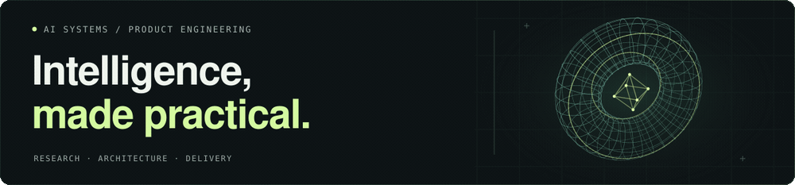

# Beefboy35

**AI Systems Architect · Senior Developer · R&D**

CTO at **StudyNinja**. I build AI products that connect agents, knowledge and real workflows. My work spans research, architecture, fullstack engineering and product delivery — from defining the problem to getting the system into people’s hands.

## Where I can help

| Your challenge | What I bring |
| :--- | :--- |
| Turn an AI idea into a product | Discovery, architecture, fullstack development and delivery. |
| Make knowledge usable | Knowledge graphs, retrieval and contextual memory for AI agents. |
| Reduce repetitive work | Workflow automation, integrations and internal tools. |

## Selected work

**[StudyNinja ↗](https://studyninja.ru)** · Adaptive education  
An AI tutor that connects diagnostics, knowledge gaps and focused practice into a personal learning path.

**KnowledgeBaseAI** · Knowledge infrastructure  
A headless graph platform designed for connected knowledge, intelligent retrieval and agent memory.

**Automation & internal tools** · Applied AI  
Fullstack platforms, analytics dashboards and integrations; HR Agent concepts for recruiting and onboarding, plus the VilaviAI product direction.

<b>Explore the research · MAGIC & Balansis</b>

**MAGIC / MagicWorld** explores human–AI collaboration through shared memory, connected knowledge and cooperating agents.

**Balansis** is an experimental computation project exploring Absolute Compensation Theory and the Zero-Sum Theory of Infinities.

<b>Open the toolbox · Stack & approach</b>

**Build:** Python · FastAPI · TypeScript · React  
**AI & data:** LLMs · RAG · PostgreSQL · Redis · Qdrant  
**Ship & automate:** Docker · CI/CD · n8n · k8s

I turn the problem into a clear scope, test the riskiest assumptions and coordinate delivery. Architecture, product decisions and implementation stay connected.

---

**Have an AI product or a process to improve?**  
[Tell me what you’re building →](https://t.me/RealBeefBoy) · [Email](mailto:a.fokin1@yandex.com)
